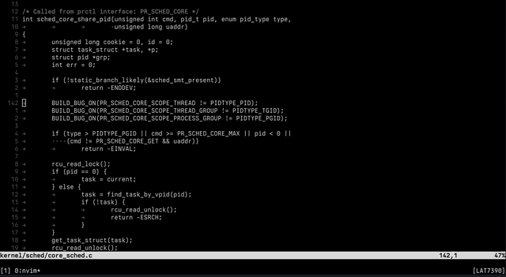

---

# Codex.nvim

A context-aware Neovim interface for the Codex CLI.

This plugin integrates with the `@openai/codex` app-server over RPC to provide direct access to your editor state. It is not a terminal wrapper — it understands your buffers, cursor position, and workspace in real time.



---

## ✨ Features

### Editor-Aware Context

Uses the app-server protocol to access:

* Active buffer contents
* Cursor position
* Project structure

### Dual-Pane Interface

A persistent side panel with:

* **Transcript**: history, diffs, and approvals
* **Prompt**: input buffer for interacting with the AI

To send a prompt, leave insert mode in the prompt buffer, then press `<Enter>`.

### `@` File Mentions

Reference files directly in prompts:

```
@filename
```

* Fuzzy search resolves files automatically
* File contents are attached to the request

### Approval Workflow

When actions are proposed (e.g. file edits or shell commands):

* Review changes in the transcript
* Approve with:

  * `y` (yes)
  * `n` (no)
  * `a` (always)

### Live RPC Feedback

Real-time status updates (e.g. *Thinking*, *Planning*, *Working*) via the UI.

---

## 🚀 Installation

### 1. Install Codex CLI and login

```
npm install -g @openai/codex
```

Login by launching the codex cli in a terminal and ensure ~/.codex/auth.json is available.


### 2. Setup Plugin (lazy.nvim)

```
{
  'eskalVAR/codex.nvim',
  opts = {
    width = 0.48,
    personality = 'pragmatic',
    -- Keymaps
    toggle_key = '<leader>cc',
    quit_key = '<C-q>',
    send_key = '<CR>',
    attach_file_key = '<C-f>',
    interrupt_key = '<C-c>',
  }
}
```

### 3. Setup With Nix

This repo includes a user-facing `flake.nix` so you can consume the plugin from another flake.

Supported systems: `x86_64-linux`, `aarch64-linux`, `x86_64-darwin`, and `aarch64-darwin`.

#### Nixvim

```nix
{
  inputs = {
    nixpkgs.url = "github:NixOS/nixpkgs/nixos-unstable";
    home-manager.url = "github:nix-community/home-manager";
    nixvim.url = "github:nix-community/nixvim";
    codex-nvim.url = "github:eskalVAR/codex.nvim";
  };

  outputs = { nixpkgs, home-manager, nixvim, codex-nvim, ... }:
  let
    system = "aarch64-darwin";
  in {
    homeConfigurations.me = home-manager.lib.homeManagerConfiguration {
      pkgs = import nixpkgs {
        inherit system;
      };

      modules = [
        nixvim.homeManagerModules.nixvim
        ({ pkgs, ... }: {
          programs.nixvim = {
            enable = true;
            extraPlugins = [
              codex-nvim.packages.${pkgs.system}.default
            ];
            extraConfigLua = ''
              require("codex").setup({})
            '';
          };
        })
      ];
    };
  };
}
```

#### Home Manager / plain Neovim

```nix
{
  inputs = {
    nixpkgs.url = "github:NixOS/nixpkgs/nixos-unstable";
    home-manager.url = "github:nix-community/home-manager";
    codex-nvim.url = "github:eskalVAR/codex.nvim";
  };

  outputs = { nixpkgs, home-manager, codex-nvim, ... }:
  let
    system = "aarch64-darwin";
  in {
    homeConfigurations.me = home-manager.lib.homeManagerConfiguration {
      pkgs = import nixpkgs {
        inherit system;
        overlays = [ codex-nvim.overlays.default ];
      };

      modules = [
        {
          programs.neovim = {
            enable = true;
            plugins = [ pkgs.vimPlugins.codex-nvim ];
            extraLuaConfig = ''
              require("codex").setup({})
            '';
          };
        }
      ];
    };
  };
}
```

---

## 🛠 Usage

### Commands

* `:Codex` — Toggle the side panel
* `:CodexToggle` — Toggle the side panel
* `:CodexSend` — Send the current prompt
* `:CodexContext` — Attach current buffer or visual selection
* `:CodexAttachFile` — Fuzzy-find and attach a file
* `:CodexInterrupt` — Stop an active request

### Sending Messages

Type your prompt in the prompt pane, press `<Esc>` to leave insert mode, then press `<Enter>` to send it.

If you remap `send_key`, use that key in normal mode instead of `<Enter>`.

---

## 🔁 Approval Flow

When the AI proposes changes:

1. Review in the transcript panel
2. Focus the prompt buffer
3. Enter:

   * `y` — approve
   * `n` — reject
   * `a` — always approve
4. Leave insert mode and press `<Enter>`

---

## 📎 File References

Example:

```
Refactor logic in @auth.lua using helpers from @utils.lua
```

* Files are resolved via fuzzy search
* Contents are automatically included in the request

---

## ⚙️ Configuration

| Option                 | Default                        | Description                     |
| ---------------------- | ------------------------------ | ------------------------------- |
| `app_server_cmd`       | `{'codex', 'app-server', ...}` | Command to start the RPC server |
| `max_attachment_lines` | `180`                          | Max lines per attached file     |
| `prompt_height`        | `7`                            | Height of the prompt window     |
| `personality`          | `'pragmatic'`                  | Tone/style of the assistant     |

---
